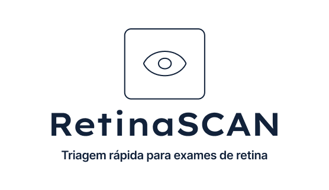
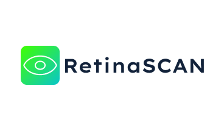
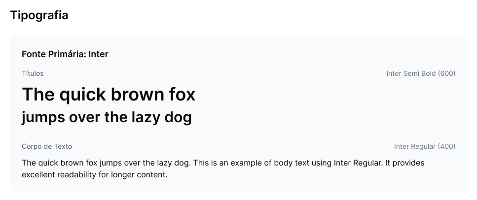
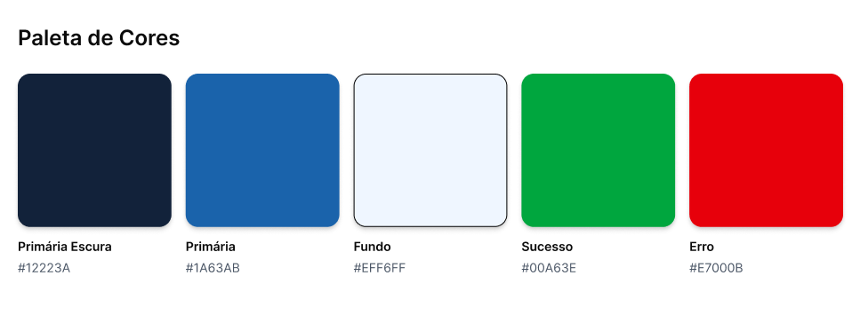

# Identidade Visual

O documento a seguir define os aspectos visuais para a implementação do sistema Web RetinaScan, como logo, fontes e paleta de cores definidas para o produto.

A seguir o documento mostra o documento de Identidade Visual realizado no Figma, juntamente com seu link de acesso, bem como o detalhamento dos elementos da Identidade Visual do RetinaScan.

<iframe style="border: 1px solid rgba(0, 0, 0, 0.1);" width="800" height="450" src="https://embed.figma.com/design/u91fnfDXTWpIsN6J9eYurD/Prototipo-Alta-Fidelidade-v1?node-id=278-308&embed-host=share" allowfullscreen></iframe>

Para acessar o documento [clique aqui](https://www.figma.com/design/u91fnfDXTWpIsN6J9eYurD/Prototipo-Alta-Fidelidade-v1?node-id=278-308&t=7k4re4T9NttDeRhP-1).

## Detalhamento da Identidade Visual

### Logo

A iconografia do logotipo do RetinaScan remete ao seu principal objetivo: a análise de exames de retina para identificação de anomalias. Por isso, foi adotado um símbolo visualmente estabelecido no âmbito da oftalmologia (o olho).

O título utiliza a fonte Lexend Exa no peso Semi Bold. Para garantir flexibilidade e contraste nas diferentes telas e componentes do sistema, o logotipo possui duas assinaturas (variações de formato) e comportamentos de cor específicos:

#### Assinatura Vertical (Principal)

Utilizada quando há espaço de respiro adequado, como em telas de login ou capas de documentos. Esta versão possui aplicação em cor sólida, alternando a cor utilizada dependendo do fundo da tela para garantir o contraste adequado, e pode vir acompanhada do slogan do projeto.

#### Assinatura Horizontal (Reduzida)

Otimizada para espaços restritos na vertical, como a barra lateral (sidebar) de navegação e cabeçalhos. Esta versão traz o ícone com um gradiente em tons de verde/ciano e mantém a tipografia, também aceitando variações de cor no texto conforme especificado no protótipo para manter o contraste nas telas.

### Fontes

As fontes definidas para o RetinaScan buscam alinhar a seriedade para a confiabilidade, agregando uma usabilidade intuitiva. Por isso, buscamos fontes simples e que passam a sensação de segurança e facilidade de leitura para os usuários.

#### Tipografia

Todos os textos do RetinaScan devem utilizar a família tipográfica **Inter**, que garante alta legibilidade nas interfaces. A aplicação da fonte varia em diferentes pesos para estabelecer uma hierarquia visual clara entre títulos e textos corridos:

- **Títulos:** Inter Semi Bold (600)
- **Corpo de Texto:** Inter Regular (400)

### Paleta de Cores

Para a paleta de cores do RetinaScan, foram definidas 5 principais cores que compõem a identidade visual central e são utilizadas ao longo de toda a aplicação:

* **Primária Escura (`#12223A`):** Utilizada na barra lateral (*sidebar*), menus de navegação e blocos de destaque.
* **Primária (`#1A63AB`):** Cor principal de ação, aplicada em botões gerais, links e elementos interativos.
* **Fundo (`#EFF6FF`):** Cor base para o background de todas as telas do sistema.
* **Sucesso (`#00A63E`):** Utilizada para feedbacks positivos, botões de confirmação e avisos (*toasts*) de sucesso.
* **Erro (`#E7000B`):** Aplicada em feedbacks negativos, ações destrutivas (como exclusões) e avisos (*toasts*) de erro.

> **Nota sobre cores neutras:** Além das cores listadas acima, a interface do RetinaScan também faz uso de tons de cinza (para textos secundários, contornos e elementos de sombra), bem como preto e branco para a cor do corpo de texto e contrastes básicos. Estes tons foram omitidos da paleta principal por serem considerados cores utilitárias e de uso padrão do sistema.

## Histórico de Versão

| Versão | Data       | Descrição | Autor        | Revisor      |
| :----: | ---------- | --------- | ------------ | ------------ |
| `1.0`  | 26/04/2026 | Adição da Id visual do RetinaScan       | [André Maia](https://github.com/andre-maia51) | [xxxx](xxxx) |