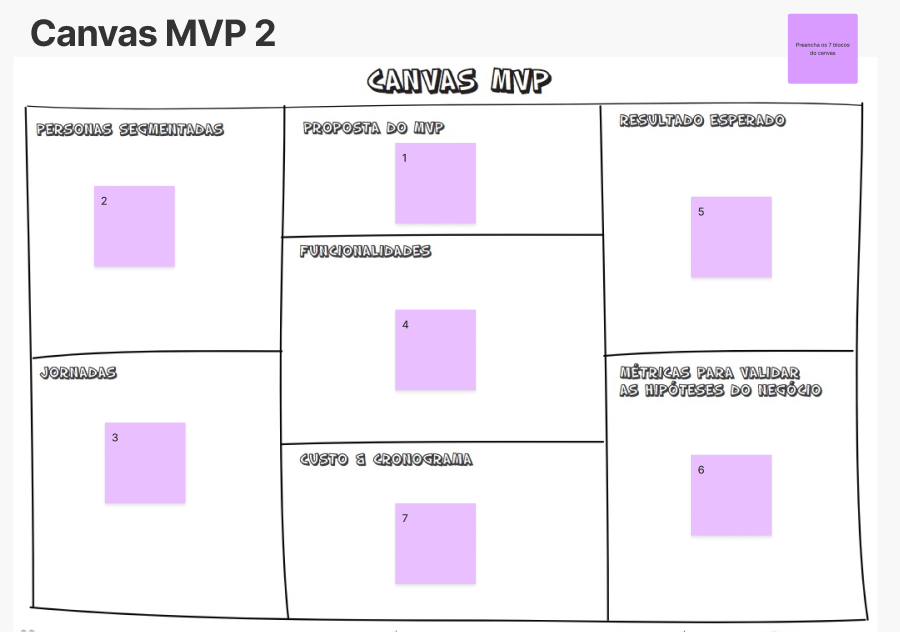
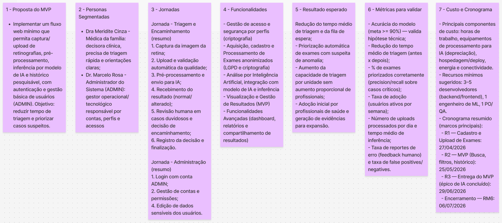

# Canvas MVP — RetinaScan

## Personas Segmentadas

- Dra Meridite Cinza — Médica da família: decisora clínica, precisa de triagem rápida e orientações claras;
- Dr. Marcelo Rosa - Administrador do Sistema (ADMIN): gestor operacional/tecnológico responsável por contas, perfis e acessos.

## Proposta do MVP

Implementar um fluxo web mínimo que permita captura/upload de retinografias, pré-processamento, inferência por modelo de IA e histórico pesquisável, com autenticação e gestão básica de usuários (ADMIN). Objetivo: reduzir tempo de triagem e priorizar casos suspeitos.

## Jornadas

### Jornada — Triagem e Encaminhamento (resumo)
1. Captura da imagem da retina;
2. Upload e validação automática da qualidade;
3. Pré-processamento e envio para IA;
4. Recebimento do resultado (normal/alterado);
5. Revisão humana em casos duvidosos e decisão de encaminhamento;
6. Registro da decisão e finalização.

### Jornada — Administração e Gestão (resumo)
1. Login com conta ADMIN;
2. Gestão de contas e permissões;
3. Edição de dados sensíveis dos usuários.

## Funcionalidades

- Gestão de acesso e segurança por perfis (criptografia)
- Aquisição, cadastro e processamento de exames anonimizados (LGPD e criptografia)
- Análise por Inteligência Artificial, integração com modelo de IA e inferência 
- Visualização e Gestão de Resultados (MVP) 
- Funcionalidades Avançadas (dashboard, relatórios e compartilhamento de resultados)

## Resultado Esperado

- Redução do tempo médio de triagem e da fila de espera;
- Priorização automática de exames com suspeita de anomalia;
- Aumento da capacidade de triagem por unidade sem aumento proporcional de profissionais;
- Adoção inicial por profissionais de saúde e geração de evidências para expansão.

## Métricas para validar as hipóteses do negócio

- Acurácia do modelo (meta >= 90%) — valida hipótese técnica;
- Redução do tempo médio de triagem (antes x depois);
- % de exames priorizados corretamente (precision/recall sobre casos críticos);
- Taxa de adoção (usuários ativos por semana);
- Número de uploads processados por dia e tempo médio de inferência;
- Taxa de reportes de erro (feedback humano) e taxa de false positives/negatives.

## Custo & Cronograma

- Principais componentes de custo: horas de trabalho, equipamentos de processamento para IA (depreciação), hospedagem/deploy, energia e conectividade.
- Recursos mínimos sugeridos: 3–5 desenvolvedores (backend/frontend), 1 engenheiro de ML, 1 PO/QA.
- Cronograma resumido (marcos principais):
  - R1 — Cadastro e Upload de Exames: 27/04/2026
  - R2_MVP — MVP (Busca, relatórios, histórico): 25/05/2026
  - R3 — Entrega do MVP (épico de IA concluído): 29/06/2026
  - Encerramento — RM6: 06/07/2026

---

Referências: `docs/produto/lean-inception.md`.

## Imagens do Canvas MVP

  
<strong>Canvas MVP — versão 1</strong>

  
  
<strong>Canvas MVP — versão 2</strong>

  
  
<strong>Fonte:</strong> Elaboração própria, 2026.

## Histórico de Versão

| Versão | Data | Descrição | Autor | Revisor |
| :----: | :--: | :-- | :-- | :-- |
| `1.0` | 19/04/2026 | Preenchimento do canvas MVP com resultados da Lean Inception | [Zenilda Vieira](https://github.com/ZenildaVieira) | [xxxx](xxxx) |