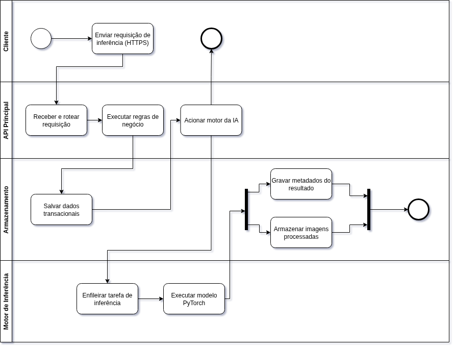
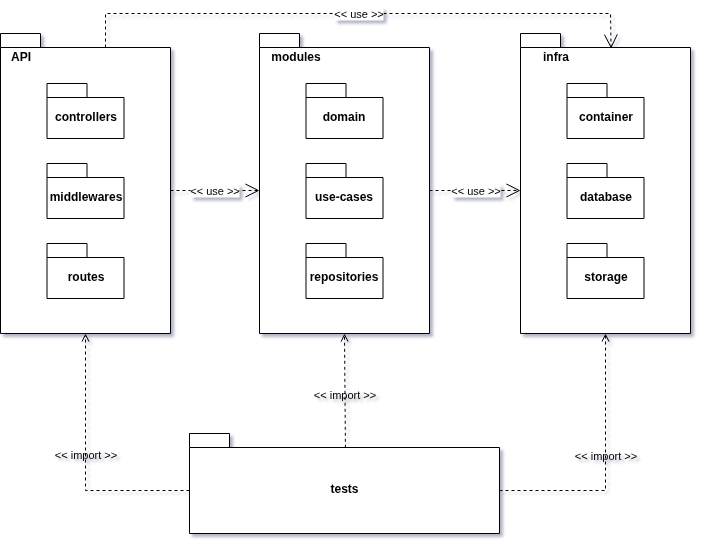
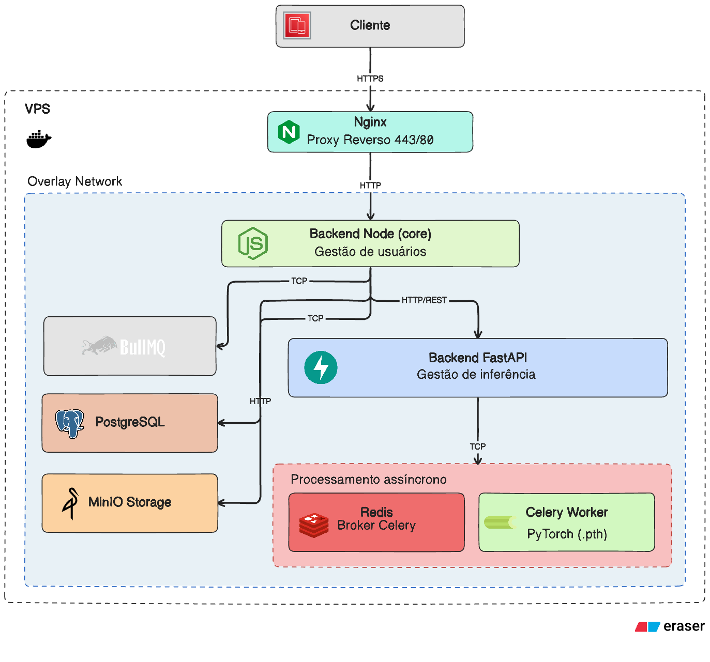

# Arquitetura

## 1. Introdução

### 1.1 Finalidade

Este documento apresenta a arquitetura da solução RetinaScan com foco nos
componentes de implantação e no fluxo de processamento das inferências.

### 1.2 Escopo

O escopo cobre:

1. visão lógica da solução e comunicação entre componentes;
2. visão de processos para execução das inferências;
3. visão de implementação baseada na estrutura de diretórios do projeto;
4. visão de implantação da infraestrutura em produção;
5. visão de dados e persistência, substituindo a visão de casos de uso.

O documento está organizado segundo o modelo 4+1 adaptado para o contexto do projeto: visão lógica, visão de processos, visão de implementação, visão de implantação e visão de dados.

### 1.3 Definições e Acrônimos

- API: Interface de Programação de Aplicações.
- HTTPS: protocolo seguro de comunicação HTTP.
- VPS: servidor privado virtual.
- IA: Inteligência Artificial.
- Broker: serviço intermediário de mensageria para filas.

## 2. Visão Lógica

A visão lógica descreve os componentes principais da solução e seus papéis funcionais.

A arquitetura está organizada em uma VPS com Docker Swarm e rede overlay,
contendo os seguintes componentes:

1. Cliente: consome a aplicação via HTTPS.
2. Nginx: atua como proxy reverso nas portas 443/80.
3. Backend Node (core): centraliza gestão de usuários e orquestração principal.
4. Backend FastAPI: executa o domínio de inferência.
5. Redis: broker de tarefas assíncronas.
6. Celery Worker: processamento de inferência com modelo PyTorch.
7. PostgreSQL: persistência relacional dos dados de domínio.
8. MinIO: armazenamento de objetos para imagens e artefatos.

### 2.1 Tecnologias e papéis

| Tecnologia | Papel na arquitetura |
| ---------- | -------------------- |
| Nginx | Entrada única da aplicação e roteamento reverso |
| Node.js | Backend central de regras de negócio e usuários |
| FastAPI | Serviço especializado de inferência |
| Redis | Fila e intermediação de tarefas assíncronas |
| Celery | Execução de jobs de inferência em segundo plano |
| PyTorch | Runtime do modelo de IA |
| PostgreSQL | Banco relacional transacional |
| MinIO | Armazenamento de imagens e arquivos |
| Docker Swarm | Orquestração dos serviços na VPS |

### 2.2 Requisitos e restrições de arquitetura

1. Todas as entradas externas devem passar pelo Nginx com HTTPS.
2. O processamento de inferência deve ser assíncrono para evitar bloqueio de API.
3. O backend principal deve permanecer desacoplado do runtime do modelo.
4. Dados transacionais devem permanecer em banco relacional.
5. Arquivos de imagem devem ser armazenados em serviço de objetos dedicado.
6. A solução deve permitir evolução modular por serviço.

## 3. Visão de Processos

A visão de processos descreve o fluxo operacional entre serviços e filas de execução.

### 3.1 Fluxo arquitetural

1. O cliente envia requisições HTTPS para o Nginx.
2. O Nginx direciona chamadas para o Backend Node.
3. O Backend Node executa regras de negócio e persiste dados no PostgreSQL.
4. Para inferência, o Backend Node aciona o Backend FastAPI.
5. O FastAPI publica tarefas no Redis para processamento assíncrono.
6. O Celery Worker consome a fila, executa o modelo PyTorch e devolve resultado.
7. Metadados são gravados no PostgreSQL e arquivos no MinIO.

### 3.2 Diagrama de Atividades



**Fonte:** [André Maia](https://github.com/andre-maia51), 2026.

## 4. Visão de Implementação
     
A visão de implementação descreve a organização interna do código e suas camadas.
   
A implementação segue a estrutura abaixo:

``` 
  env
  src
  |- api
  |  |- docs
  |  |- middlewares
  |  |- routes
  |  |- types
  |- infra
  |  |- auth
  |  |- container
  |  |- database
  |  |  |- drizzle
  |  |     |- migrations
  |  |     |- repositories
  |  |     |- schema
  |  |- health
  |  |- http
  |  |- logger
  |  |- queue
  |  |  |- workers
  |  |- shared
  |  |- storage
  |- lib
  |- modules
  |  |- exam
  |  |  |- patient
  |  |  |  |- use-cases
  |  |  |- use-cases
  |  |- users
  |     |- domain
  |     |- repositories
  |     |- use-cases
  |- shared
  |  |- errors
  |  |- services
  |  |- validators
  |- tests
     |- helpers
     |  |- builders
     |- integration
     |  |- repositories
     |  |- setup
     |- unit
        |- api
        |- infra
        |- modules
        |- shared
``` 

### 4.1 Camada api

Responsável pela borda HTTP da aplicação (Fastify):

- `routes`: definem endpoints, validação via Zod e composição de rotas; cada rota orquestra parsing
da requisição e chamada do caso de uso resolvido pelo container, sem regra de negócio.
- `middlewares`: aplicam autenticação, autorização e o tratamento global de erros, traduzindo
exceções de domínio para respostas HTTP.
- `docs`: configuração do Swagger exposto em `/docs`.
- `types`: tipos compartilhados da camada HTTP.

### 4.2 Camada infra

Responsável por detalhes técnicos de infraestrutura e pelas implementações concretas das interfaces declaradas no domínio:

- `auth`: implementação do serviço de autenticação sobre better-auth.
- `container`: ponto único de injeção de dependências (awilix); registra repositórios e serviços
como singletons e casos de uso como escopo por requisição.
- `database`: conexão Drizzle ORM com PostgreSQL, organizada em schema (definição das tabelas),
migrations (versionamento) e repositories (implementações concretas das interfaces dos módulos).
- `health`: endpoint e verificações de saúde da aplicação.
- `http`: cliente HTTP de saída (axios) para integrações com serviços externos.
- `logger`: configuração do logger estruturado.
- `queue`: fila assíncrona baseada em BullMQ, com workers responsáveis pelo consumo de jobs (ex.:
notificações e integrações com o serviço de inferência).
- `shared`: serviços transversais de criptografia e mascaramento de dados sensíveis.
- `storage`: integração com MinIO para upload, download e geração de URLs assinadas.

### 4.3 Camada modules

Responsável pelo domínio de negócio, com separação por contexto delimitado. Cada módulo expõe entidades, interfaces de repositório e casos de uso; as implementações concretas dos repositórios vivem em `infra/database/drizzle/repositories`, preservando a inversão de dependência.

- `exam`: domínio principal da solução. Reúne entidades (Exame, Imagem, ResultadoIa, ExameIaError, Comorbidade), suas interfaces de repositório e os casos de uso de exame (upload de imagens, recuperação de detalhes, registro de erros de inferência, etc.). O submódulo patient agrupa os
casos de uso relacionados a pacientes vinculados ao exame.
- `users`: domínio de usuários, organizado em domain (entidades e contratos), repositories (interfaces) e use-cases (orquestração da lógica de aplicação).

### 4.4 Camada lib
  
Contém integrações de bibliotecas externas configuradas uma única vez para a aplicação, como a instância do better-auth consumida pelo AuthService.

### 4.5 Camada shared

Reúne contratos e utilitários compartilhados entre módulos e camadas:

- `errors`: hierarquia de erros de domínio (NotFoundError, UnauthorizedError, ConflictError, entre outros) traduzidos para HTTP pelo middleware global.
- `services`: interfaces de serviços transversais (AuthService, StorageService, CryptographyService, MaskingService) consumidas pelos casos de uso e implementadas em infra/.
- `validators`: validações reutilizáveis de domínio.

### 4.6 Camada tests

Estrutura os três níveis de teste praticados no projeto:

- `unit`: valida regras isoladas de casos de uso, validações e utilitários, com mocks das interfaces de repositório e serviços. Organizada espelhando a estrutura de src/ (api, infra, modules,
shared).
- `integration`: valida a integração entre rotas, casos de uso, repositórios reais e serviços de infraestrutura.
- `helpers/builders`: utiliza o design pattern de builder para construção de estado de teste

### 4.7 Diagrama de Pacotes



**Fonte:** [André Maia](https://github.com/andre-maia51), 2026.

## 5. Visão de Implantação

A visão de implantação descreve a topologia de execução em produção.



**Fonte:** Equipe RetinaScan, 2026.

## 6. Visão de Dados

No processo da disciplina, a visão de dados substitui a visão de casos de uso para representar o domínio e a persistência da solução.

O domínio de dados da solução está detalhado em Modelagem do Banco de Dados,
incluindo entidades como Usuario, Paciente, Atendimento, Exame, Imagem,
Analise e Revisao.

Nesta arquitetura:

1. PostgreSQL armazena dados estruturados e históricos.
2. MinIO armazena artefatos binários (imagens e derivados).
3. O vínculo entre registros do banco e arquivos no storage garante rastreio fim a fim.

## 7. Decisões Arquiteturais

| Decisão | Justificativa | Impacto |
| ------- | ------------- | ------- |
| Entrada única via Nginx | Centraliza segurança, roteamento e TLS | Maior controle operacional |
| Node.js como core | Consolida regras de domínio e gestão de usuários | Menor acoplamento com inferência |
| FastAPI para inferência | Isola carga computacional do modelo | Escala independente de serviço |
| Redis + Celery | Permite processamento assíncrono resiliente | Melhor tempo de resposta da API |
| PostgreSQL + MinIO | Separação entre dado transacional e binário | Melhor desempenho e manutenção |

## 8. Riscos e Mitigações

1. Fila assíncrona congestionada em picos.
Mitigação: escalar workers e aplicar monitoramento de fila.
2. Ponto único de entrada no proxy.
Mitigação: política de backup de configuração e observabilidade do Nginx.
3. Divergência entre metadados e arquivos de imagem.
Mitigação: validação transacional de vínculo entre banco e storage.


## Histórico de Versão

| Versão | Data       | Descrição | Autor        | Revisor      |
| :----: | ---------- | --------- | ------------ | ------------ |
| `1.0`  | 12/04/2026 | Criação do documento de arquitetura | [Yan Luca Viana](https://github.com/yan-luca) |  |
| `1.1`  | 26/04/2026 | Reestruturação do documento para o formato 4+1  (lógica, processos, implementação, implantação e dados) | [Zenilda Vieira](https://github.com/zenildavieira) e Github Copilot|  |
| `1.2`  | 24/05/2026 | Refatoração da visão de implementação e adição de diagramas | [André Maia](https://github.com/andre-maia51)| [Natália De Morais](https://github.com/Natyrodrigues)  |