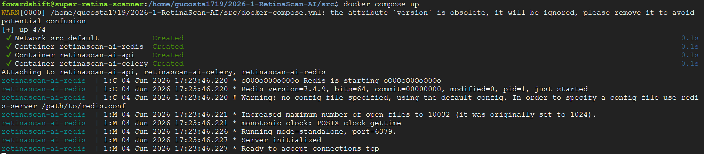
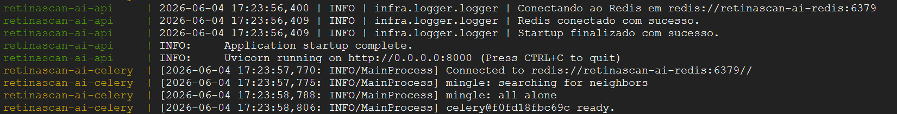
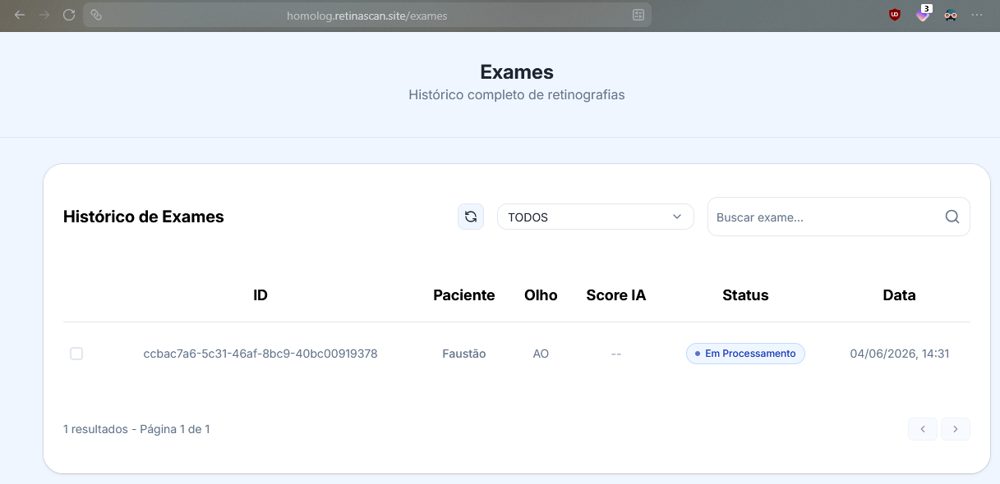
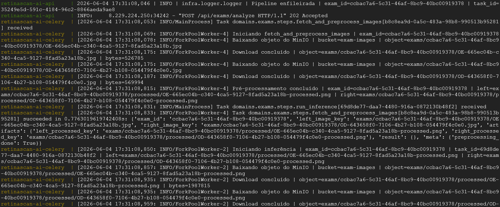
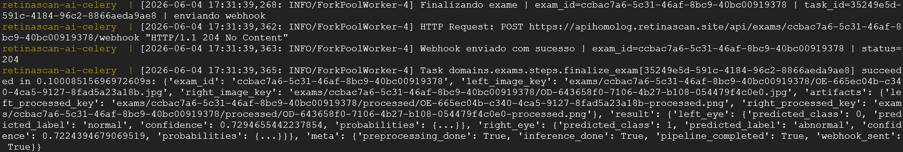
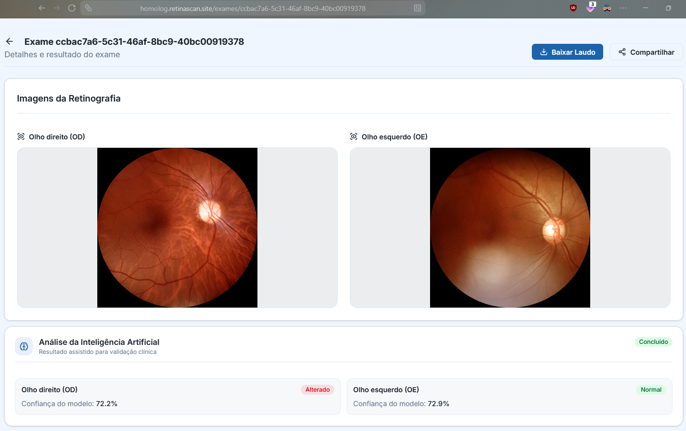

# Migração da Infraestrutura de IA para Google Cloud

## Objetivo

Este documento descreve o processo de migração do serviço de Inteligência Artificial do projeto, anteriormente executado em uma máquina pessoal de um dos integrantes da equipe, para a infraestrutura da Google Cloud Platform (GCP).

A mudança teve como objetivo aumentar a disponibilidade do serviço, centralizar a infraestrutura e reduzir a dependência de recursos locais.

---

## Arquitetura Anterior

Anteriormente, o modelo de IA era executado em uma máquina pessoal pertencente a um integrante da equipe.

### Limitações

* Dependência da disponibilidade do computador do integrante.
* Possibilidade de indisponibilidade devido a desligamentos ou falhas locais.
* Dificuldade de monitoramento contínuo.
* Escalabilidade limitada.
* Processo de manutenção dependente de acesso ao equipamento físico.

---

## Nova Arquitetura

A aplicação foi migrada para a Google Cloud Platform.

### Componentes Utilizados

* Google Compute Engine (VM)
* Docker
* Modelo de IA

### Benefícios

* Maior disponibilidade do serviço.
* Infraestrutura centralizada.
* Facilidade de monitoramento.
* Possibilidade de escalabilidade futura.
* Independência de recursos pessoais dos integrantes.

---

## Configuração do Ambiente

### Provisionamento da Máquina Virtual

Foi criada uma instância na Google Cloud com as seguintes especificações:

* Sistema operacional `Debian 12 v20260528`
* Tipo da Máquina `e2-custom-4-8192 (4 vCPUs, 8 GB Memory)`
* Plataforma da CPU `Intel Broadwell` 

### Configuração da Rede

Através do Google Cloud Console, foram configuradas as regras necessárias para:

* Acesso SSH para administração.
* Exposição das portas utilizadas pelo serviço.

---

## Processo de Deploy

### 1. Acesso à Instância

```bash
gcloud compute ssh super-retina-scanner
```

### 2. Obtenção do Código

```bash
git clone https://github.com/fga-eps-mds/2026-1-RetinaScan-Ai.git
cd 2026-1-RetinaScan-Ai
```

### 3. Configuração das Variáveis

Criado o arquivo `.env` com os seguintes campos:

```bash
APP_NAME=
VERSION=

ALLOWED_ORIGINS=

REDIS_URL=

MINIO_ENDPOINT=
MINIO_PORT=
MINIO_SECURE=
MINIO_ACCESS_KEY=
MINIO_SECRET_KEY=
MINIO_PUBLIC_URL=
MINIO_BUCKET_EXAMS=

WEBHOOK_URL=
```

### 4. Inicialização dos Serviços

```bash
docker compose up -d
```

### 5. Verificação dos Containers

```bash
docker ps
```

### 6. Verificação dos Logs

```bash
docker compose logs -f
```

---

## Validação Funcional

Após a implantação, foram realizados testes para validar o funcionamento da IA.

### Testes Executados

| Teste                          | Resultado |
| ------------------------------ | --------- |
| Inicialização dos containers   | Sucesso   |
| Conexão com o REDIS            | Sucesso   |
| Processamento de requisições   | Sucesso   |
| Retorno de respostas esperadas | Sucesso   |

#### Evidências

Container iniciado:



Conexão com o REDIS:



Criação de um exame pelo site do projeto:



Imagem em processamento:



Processamento da imagem finalizado:



Resultado no website:




### Resultado

O serviço apresentou comportamento compatível com o ambiente anterior, mantendo as funcionalidades esperadas após a migração para a nuvem.

---

## Critérios de Aceitação

| Critério                                          | Status |
| ------------------------------------------------- | ------ |
| IA implantada e em execução na Google Cloud       | ✅      |
| Recursos necessários configurados corretamente    | ✅      |
| Serviço acessível no ambiente de nuvem            | ✅      |
| Processo de deploy documentado                    | ✅      |
| Logs disponíveis para monitoramento e diagnóstico | ✅      |
| Validação funcional realizada                     | ✅      |
| Ausência de erros críticos para produção          | ✅      |

---

## Conclusão

A migração do serviço de Inteligência Artificial para a Google Cloud foi concluída com sucesso. O ambiente encontra-se operacional, acessível e monitorável, eliminando a dependência da infraestrutura pessoal anteriormente utilizada e proporcionando maior confiabilidade para a execução do serviço.
