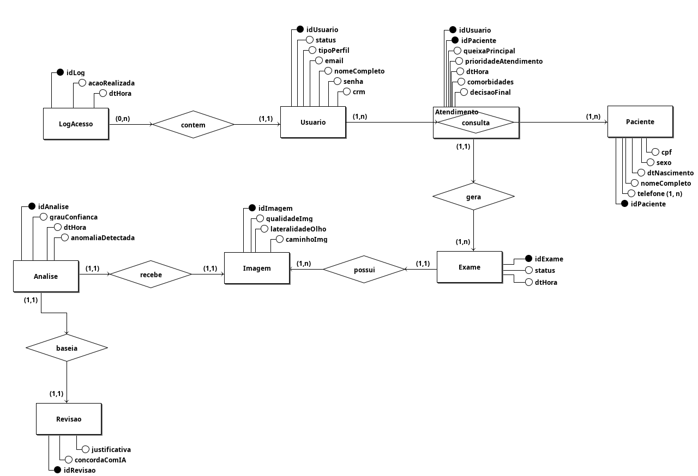
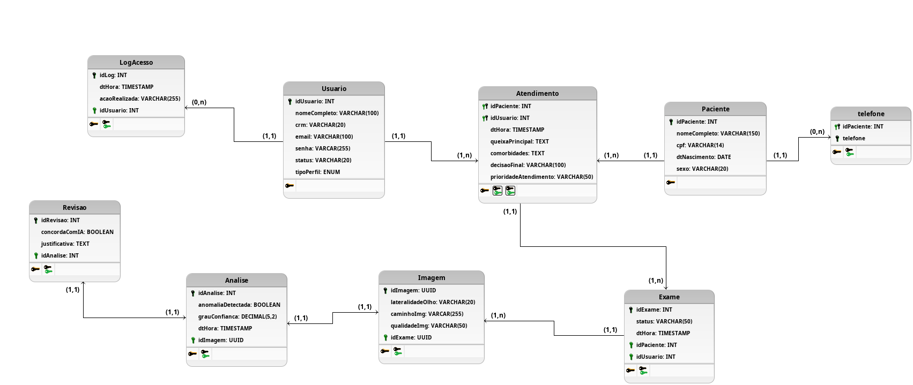

# Modelagem do banco de dados

## Entidades
* Usuario
* LogAcesso
* Paciente
* Atendimento
* Exame
* Imagem
* AnaliseIA
* Revisao

## Descrição das Entidades
* **Usuario** (<u>idUsuario</u>, nomeCompleto, crm, email, senha, tipoPerfil, status)
* **LogAcesso** (<u>idLog</u>, dtHora, acaoRealizada)
* **Paciente** (<u>idPaciente</u>, nomeCompleto, cpf, dtNascimento, sexo, {telefone})
* **Atendimento** (<u>idPaciente</u>, <u>idUsuario</u>, dtHora, queixaPrincipal, comorbidades, decisaoFinal, proridadeAtendimento)
* **Exame** (<u>idExame</u>, dtHora, status)
* **Imagem** (<u>idImagem</u>, lateralidadeOlho, caminhoImg, qualidadeImg)
* **Analise** (<u>idAnalise</u>, anomaliaDetectada, grauConfianca, dtHora)
* **Revisao** (<u>idRevisao</u>, concordaComIA, justificativa)

## Relacionamentos

* LogAcesso - **contém** - Usuario
    * Um LogAcesso contém as informações de um e somente um Usuario, enquanto um Usuario pode estar contido em um ou mais LogAcesso.
    * Cardinalidade: **(n:1)**

* Usuario - **consulta** - Paciente
    * Um Usuario consulta um ou mais Pacientes e um Paciente pode ser consultado por um ou mais Usuarios.
    * Cardinalidade: **(n:m)**

* Atendimento - **gera** - Exame
    * Um Atendimento pode gerar um ou mais Exames, já um Exame está atrelado a um e somente um Atendimento.
    * Cardinalidade: **(n:1)**

* Exame - **possui** - Imagem
    * Um Exame possui uma ou mais Imagens, e uma Imagem é possuída por um e apenas um Exame.
    * Cardinalidade: **(n:1)**

* Imagem - **recebe** - Analise
    * Uma Imagem recebe uma e apenas uma Analise da IA, e uma Analise avalia uma e somente uma Imagem.
    * Cardinalidade: **(1:1)**

* Analise - **baseia** - Revisao
    * Uma Revisao é baseada em uma e somente uma Analise, e uma Analise baseia um e apenas uma Revisao.
    * Cardinalidade: **(1:1)**

## Diagrama Entidade Relacionamento

**Fonte:** [André Maia](https://github.com/andre-maia51), 2026. 

## Diagrama Lógico

**Fonte:** [André Maia](https://github.com/andre-maia51), 2026. 

## Dicionário de Dados

### Usuario

* **Esclarecimento Técnico:** Tabela proveniente de uma Entidade.
* **Descrição:** Define os dados dos profissionais de saúde e administradores que acessam o sistema RetinaScan.

| Atributo | Propriedades do Atributo | Tipo de Dados | Tamanho | Descrição |
| -------- | ------------------------ | :-----------: | :-----: | --------- |
| idUsuario | chave primária, obrigatório | int | - | Identificador único do usuário no sistema |
| nomeCompleto | obrigatório | varchar | 150 | Nome completo do profissional |
| crm | opcional | varchar | 20 | Registro profissional (obrigatório apenas para médicos) |
| email | obrigatório, único | varchar | 100 | E-mail de acesso ao sistema |
| senha | obrigatório | varchar | 255 | Senha de acesso criptografada |
| tipoPerfil | obrigatório | enum | - | Nível de acesso (ex: ADMIN, MEDICO_TRIAGEM) |
| status | obrigatório | varchar | 20 | Situação do cadastro (ex: Ativo, Inativo) |

### LogAcesso

* **Esclarecimento Técnico:** Tabela proveniente de uma Entidade.
* **Descrição:** Registra a trilha de auditoria e ações realizadas pelos usuários no sistema.

| Atributo | Propriedades do Atributo | Tipo de Dados | Tamanho | Descrição |
| -------- | ------------------------ | :-----------: | :-----: | --------- |
| idLog | chave primária, obrigatório | int | - | Identificador único do registro de log |
| idUsuario | chave estrangeira, obrigatório | int | - | Identificador do usuário que realizou a ação |
| dtHora | obrigatório | timestamp | - | Data e hora exata em que a ação ocorreu |
| acaoRealizada | obrigatório | varchar | 255 | Descrição da ação (ex: Login, Cadastro de Exame) |

### Paciente

* **Esclarecimento Técnico:** Tabela proveniente de uma Entidade.
* **Descrição:** Armazena os dados demográficos e de contato dos pacientes atendidos.

| Atributo | Propriedades do Atributo | Tipo de Dados | Tamanho | Descrição |
| -------- | ------------------------ | :-----------: | :-----: | --------- |
| idPaciente | chave primária, obrigatório | int | - | Identificador único do paciente no sistema |
| nomeCompleto | obrigatório | varchar | 150 | Nome completo do paciente |
| cpf | obrigatório, único | varchar | 14 | CPF ou Cartão SUS do paciente |
| dtNascimento | obrigatório | date | - | Data de nascimento para cálculo de idade |
| sexo | obrigatório | varchar | 20 | Sexo biológico do paciente |

### Telefone

* **Esclarecimento Técnico:** Tabela proveniente de um Atributo Multivalorado.
* **Descrição:**  Número(s) de telefone de contato do paciente cadastrada.

| Atributo | Propriedades do Atributo | Tipo de Dados | Tamanho | Descrição |
| -------- | ------------------------ | :-----------: | :-----: | --------- |
| idPaciente | chave primária, chave estrangeira, obrigatorio | int | - | Identificador do Paciente Vinculado |
| numeroTelefone | chave primária, obrigatório | varchar | 20 | Número de telefone de contato |

### Atendimento

* **Esclarecimento Técnico:** Tabela proveniente de uma Entidade Associativa.
* **Descrição:** Registra o evento da consulta/triagem, conectando o usuário (profissional) ao paciente em uma data específica.

| Atributo | Propriedades do Atributo | Tipo de Dados | Tamanho | Descrição |
| -------- | ------------------------ | :-----------: | :-----: | --------- |
| idUsuario | chave primária, chave estrangeira, obrigatório | int | - | Identificador do profissional que realizou o atendimento |
| idPaciente | chave primária, chave estrangeira, obrigatório | int | - | Identificador do paciente atendido |
| dtHora | obrigatório | timestamp | - | Data e hora em que o atendimento foi iniciado |
| queixaPrincipal | obrigatório | text | - | Relato dos sintomas ou motivo da visita |
| comorbidades | opcional | text | - | Doenças pré-existentes (ex: diabetes, hipertensão) |
| decisaoFinal | obrigatório | varchar | 100 | Encaminhamento realizado (ex: Encaminhado ao Oftalmologista) |
| proridadeAtendimento | obrigatório | varchar | 50 | Nível de urgência definido na triagem (ex: Alta, Normal) |

### Exame

* **Esclarecimento Técnico:** Tabela proveniente de uma Entidade.
* **Descrição:** Agrupa as capturas de imagens de retina realizadas dentro de um atendimento específico.

| Atributo | Propriedades do Atributo | Tipo de Dados | Tamanho | Descrição |
| -------- | ------------------------ | :-----------: | :-----: | --------- |
| idExame | chave primária, obrigatório | int | - | Identificador único do exame |
| idAtendimento | chave estrangeira, obrigatório | int | - | Identificador do atendimento gerador do exame |
| dtHora | obrigatório | timestamp | - | Data e hora da realização da captura |
| status | obrigatório | varchar | 50 | Situação atual do exame (ex: Concluído, Em Processamento) |

### Imagem

* **Esclarecimento Técnico:** Tabela proveniente de uma Entidade.
* **Descrição:** Armazena as referências dos arquivos anonimizados capturados de cada olho do paciente.

| Atributo | Propriedades do Atributo | Tipo de Dados | Tamanho | Descrição |
| -------- | ------------------------ | :-----------: | :-----: | --------- |
| idImagem | chave primária, obrigatório | uuid | 36 | Identificador único da imagem |
| idExame | chave estrangeira, obrigatório | int | - | Identificador do exame ao qual a foto pertence |
| lateralidadeOlho | obrigatório | varchar | 20 | Indica se é o Olho Direito ou Olho Esquerdo |
| caminhoImg | obrigatório | varchar | 255 | URL ou caminho do arquivo anonimizado no servidor/storage |
| qualidadeImg | obrigatório | varchar | 50 | Status do pré-processamento (ex: Adequada, Inadequada) |

### Analise

* **Esclarecimento Técnico:** Tabela proveniente de uma Entidade.
* **Descrição:** Guarda exclusivamente o laudo/inferência gerado pelo modelo de Inteligência Artificial para uma imagem específica.

| Atributo | Propriedades do Atributo | Tipo de Dados | Tamanho | Descrição |
| -------- | ------------------------ | :-----------: | :-----: | --------- |
| idAnalise | chave primária, obrigatório | int | - | Identificador único do resultado da IA |
| idImagem | chave estrangeira, obrigatório, único | uuid | 36 | Identificador da imagem avaliada pela IA |
| anomaliaDetectada | obrigatório | boolean | - | Flag indicando se a IA detectou problema (True/False) |
| grauConfianca | obrigatório | decimal | 5,2 | Percentual de acurácia retornado pelo modelo (ex: 90.50) |
| dtHora | obrigatório | timestamp | - | Data e hora exata em que a inferência foi concluída |

### Revisao

* **Esclarecimento Técnico:** Tabela proveniente de uma Entidade.
* **Descrição:** Registra o feedback do profissional de saúde sobre o resultado retornado pela Inteligência Artificial.

| Atributo | Propriedades do Atributo | Tipo de Dados | Tamanho | Descrição |
| -------- | ------------------------ | :-----------: | :-----: | --------- |
| idRevisao | chave primária, obrigatório | int | - | Identificador único da revisão médica |
| idAnalise | chave estrangeira, obrigatório, único | int | - | Identificador da análise da IA que está sendo revisada |
| concordaComIA | obrigatório | boolean | - | Flag indicando se o médico concordou com a IA (True/False) |
| justificativa | opcional | text | - | Texto preenchido caso o médico reporte erro na IA |

## Histórico de Versão

| Versão | Data       | Descrição | Autor        | Revisor      |
| :----: | ---------- | --------- | ------------ | ------------ |
| `1.0`  | 11/04/2026 | Criação do documento de modelagem do Banco de Dados       | [André Maia](https://github.com/andre-maia51) | [xxxx](xxxx) |